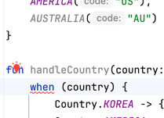

# 코틀린에서 다양한 클래스를 다루는 방법

## Data Class
- 계층간의 데이터를 전달하기 위한 DTO역할을 하는 클래스
- `data` 키워드를  class 앞에 붙여서 사용하면 equals, hashCode, toString을 자동으로 만들어준다.
    ```kotlin
    data class PersonDto(
        val name: String,
        val age: Int
    )
    
    class Person(
        val name: String,
        val age: Int
    )

    fun main() {
        val dto1 = PersonDto("A", 100)
        val dto2 = PersonDto("A", 100)
        println(dto1 == dto2) // true
    
        val person1 = Person("B", 100)
        val person2 = Person("B", 100)
        println(person1 == person2) // false
    }
    ```
- `data` 키워드가 붙지 않은 클래스는 같은 값이여도 equals가 구현되어있지 않기 때문에 false가 나온다.
- 여기에 `named argument`를 활용하면 builder패턴을 사용하는 것과 비슷하게 사용할 수 있다.

## Enum Class
- 클래스와 마찬가지로 프로퍼티를 생성자와 함께 만든다.
    ```kotlin
    enum class Country(
        val code: String
    ) {
        KOREA("KO"),
        AMERICA("US")
    }
    ```
- `enum`에 대한 분기처리를 할 때 `when` 을 사용해서 좀 더 쉽게 분기처리를 할 수 있다.
- 컴파일러가 `enum class`의 모든 타입을 알고 있어 다른 타입에 대한 `else`를 작성하지 않아도 된다.
- 만약 타입이 추가가 된다면 IDE단에서 경고표시가 나온다.
   

Sealed Class, Sealed Interface
- 외부에서는 상속받을수 없는 클래스
- 하위 클래스는 같은 패키지에 있어야 한다.
- 추상화가 필요한 entity나 Dto에 open대신 sealed 클래스를 사용할 수있다
- Enum Class와 다른점
  - 클래스를 상속받을 수 있다.
  - 하위 클래스는 멀티 인스턴스가 가능하다.