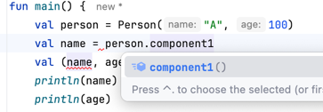

# 코틀린의 여러가지 문법이나 개념

## `Type Alias` 와 `as import`
- 긴 이름의 클래스 혹은 함수 타입이 있을때 축약하거나 더 좋은 이름으로 쓸 수 있다.
- `(Fruit) -> Boolean`이라는 함수 타입이 길경우 아래와 같이 사용할 수 있다.
    ```kotlin
    typealias FruitFilter = (Fruit) -> Boolean
    fun filterFruits(fruits: List<Fruit>, filter: FruitFilter) {
        
    }
    ```
- 긴 이름의 클래스를 컬렉션에 사용할 때도 간단히 줄일 수 있다.
    ```kotlin
    data class UltraSuperGuardianTribe(
        val name: String
    )
    typealias USGMap = Map<String, UltraSuperGuardianTribe>
    val map: USGMap = emptyMap()
    ```
- 다른 패키지의 같은 이름 함수를 동시에 가져오고 싶을 경우 `as import`를 사용해서 가져올 수 있다.
  - 어떤 함수나 클래스를 임포트할때 이름을 바꾸는 기능
  - `import 패키지 as 이름`

## 구조분해와 `componentN` 함수
- 복합적인 값을 분해해서 여러 변수를 한 번에 초기화하는 것
    ```kotlin
    val person = Person("A", 100)
    val (name, age) = person
    println(name) // A
    println(age) // 100
    ```
- `Data Class`는 기본적으로 `componentN`이란 함수가 자동으로 생성된다.

  

- `componentN`은 `N`번째 프로퍼티를 가져오는 함수다.
- Data Class가 아닌 경우에는 `componentN` 함수를 직접 만들어서 사용하면 된다.
  - 이럴때에는 앞에 `operator` 키워드를 붙여야한다.
    ```kotlin
    operator fun component1(): String {
        return name
    }
    
    operator fun component2(): Int {
        return age
    }
    ```
- for문을 사용할 때 index, key와 value를 함께 가져오는 것도 구조분해를 사용하는 것이다.

## `takeIf` 와 `takeUnless`
- 간단한 코드를 짧게 바꿀때 `takeIf`를 사용할 수 있다.
```kotlin
fun getNumberOrNull(): Int? {
    return if (number <= 0) {
        null
    } else {
        number
    }
}

fun getNumberOrNullV2(): Int? {
  return number.takeIf { it > 0} // 조건이 참이면 number를 반환하고 아니면 null을 반환한다.
}

```
- `takeUnless` : 주어진 조건을 만족하지 않으면 그 값을, 그렇지 않으면 null을 반환한다.