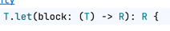
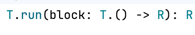

# 코틀린의 scope function

## scope function이란?

- `scope` : 영역, `function` : 함수 -> 영역 함수

```kotlin
fun printPerson(person: Person?) {
    person?.let { // scope function의 한 종류
        println(it.name)
        println(it.age)
    }
} // 일시적인 영역이 생겼다.
```

- 람다를 사용해 일시적인 영역을 만들고 코드를 더 간결하게 만든다.

## scope function 의 분류

- `let`, `run`, `also`, `apply`, `with` 등이 존재한다.




| 반환값 / 수신 객체 | it 사용 | this 사용(확장 함수 형식) |
|-------------|-------|-------------------|
| 람다의 결과      | let   | run               |
| 객체 그 자체     | also  | apply             |

- `with` 은 확장함수가 아니기 때문에 `with() {}` 형태로 사용한다.

## 언제 어떤 scope function 을 사용해야 할까?
- let
  - 하나 이상의 함수를 call chain 결과로 호출 할 때
  - 일회성으로 제한된 영역에 지역 변수를 만들 때
- run
  - 객체를 만들어 DB에 바로 저장하고, 그 인스턴스를 활용할 때

## scope function 과 가독성
- 만약 자바 개발자와 같이 개발할 경우나 코드의 흐름 복잡도로 인해 사용하기가 애매하다.
- 만약 리펙토링했을때 복잡도가 높아질 경우 사용하면 좋을거 같다.
- 보는사람에따라 코드가 복잡해 보일 수 있고 숙련되지 않는다면 이해하지 못할 수 있다.